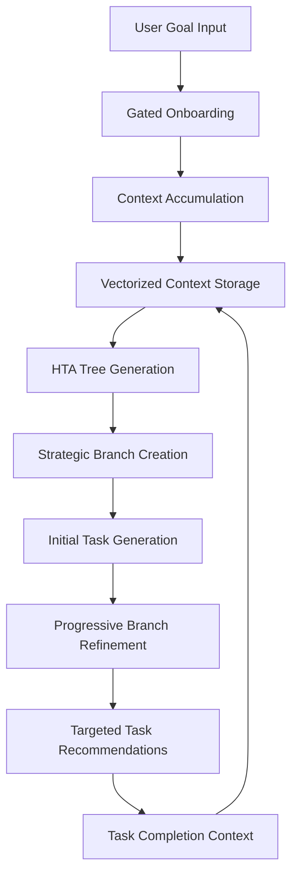

# Design Document

## Overview

The Forest learning system's context snowball architecture is currently broken at the HTA tree generation phase. The design fixes this by ensuring proper context flow from onboarding through HTA generation, creating a sophisticated vectorized tree where strategic branches progressively refine from contextually relevant to highly targeted as users advance. The solution eliminates generic template fallbacks by leveraging accumulated user context at every stage.

## Architecture

### Context Flow Pipeline



### Context Snowball Effect

The system maintains a growing context vector that influences every stage:

1. **Onboarding Context**: User background, experience, preferences, constraints
2. **Goal Context**: Specific learning objective, success criteria, timeline
3. **Progress Context**: Completed tasks, learning patterns, difficulty preferences
4. **Refinement Context**: User feedback, completion quality, engagement metrics

### Vectorized Tree Structure

The HTA tree contains multiple layers of context-aware nodes:

- **Visible Branches**: Currently active strategic branches shown to user
- **Prepared Branches**: Next-level branches with metadata and indicators
- **Deep Tree**: Extensive branch network with progressive refinement markers
- **Context Anchors**: Vectorized context points that influence branch evolution

## Components and Interfaces

### Enhanced Context Manager

```javascript
class ContextManager {
  constructor(vectorProvider, dataPersistence) {
    this.vectorProvider = vectorProvider;
    this.dataPersistence = dataPersistence;
    this.contextLayers = new Map();
  }

  async accumulateOnboardingContext(sessionId, contextData) {
    // Store and vectorize onboarding context
    const contextVector = await this.vectorProvider.vectorize(contextData);
    await this.storeContextLayer('onboarding', sessionId, contextVector);
  }

  async getAccumulatedContext(projectId) {
    // Retrieve all context layers for HTA generation
    const layers = await this.getAllContextLayers(projectId);
    return this.mergeContextLayers(layers);
  }

  async refineContextFromCompletion(projectId, taskId, completionData) {
    // Add task completion context to the snowball
    const refinementVector = await this.vectorProvider.vectorize(completionData);
    await this.storeContextLayer('completion', projectId, refinementVector);
  }
}
```

### Context-Aware HTA Generator

```javascript
class ContextAwareHTAGenerator {
  constructor(llmInterface, contextManager, vectorProvider) {
    this.llmInterface = llmInterface;
    this.contextManager = contextManager;
    this.vectorProvider = vectorProvider;
  }

  async generateStrategicBranches(goal, projectId) {
    // Get accumulated context
    const context = await this.contextManager.getAccumulatedContext(projectId);
    
    // Generate context-aware branches
    const branches = await this.llmInterface.generateContent({
      type: 'strategicBranches',
      goal: goal,
      context: context,
      prompt: this.buildContextualPrompt(goal, context),
      schema: this.getStrategicBranchSchema(),
      systemMessage: this.buildContextualSystemMessage(context),
      requireContextSpecific: true,
      avoidGenericTemplates: true
    });

    // Validate and refine branches
    return await this.validateAndRefinebranches(branches, context);
  }

  buildContextualPrompt(goal, context) {
    return `Generate strategic learning branches for: "${goal}"
    
    User Context:
    - Background: ${context.background || 'Not specified'}
    - Experience Level: ${context.experience || 'Not specified'}
    - Learning Style: ${context.learningStyle || 'Not specified'}
    - Time Constraints: ${context.timeConstraints || 'Not specified'}
    - Specific Interests: ${context.interests || 'Not specified'}
    
    Create branches that are specifically tailored to this user's context and goal.
    Avoid generic phases like "Foundation Phase" or "Development Phase".
    Instead, create contextually relevant branches that reflect the user's specific situation.`;
  }
}
```

### Progressive Branch Refinement Engine

```javascript
class ProgressiveBranchRefinement {
  constructor(contextManager, vectorProvider, llmInterface) {
    this.contextManager = contextManager;
    this.vectorProvider = vectorProvider;
    this.llmInterface = llmInterface;
  }

  async refineBranchForUser(branchId, projectId, userProgress) {
    // Get current context including progress
    const context = await this.contextManager.getAccumulatedContext(projectId);
    const progressContext = await this.analyzeUserProgress(userProgress);
    
    // Refine branch based on accumulated context
    const refinedBranch = await this.llmInterface.generateContent({
      type: 'branchRefinement',
      branchId: branchId,
      context: { ...context, progress: progressContext },
      prompt: this.buildRefinementPrompt(branchId, context, progressContext),
      schema: this.getRefinedBranchSchema(),
      systemMessage: 'Refine this branch to be highly targeted based on user progress and context'
    });

    return refinedBranch;
  }

  async analyzeUserProgress(userProgress) {
    // Analyze completion patterns, difficulty preferences, engagement
    return {
      completionRate: this.calculateCompletionRate(userProgress),
      difficultyPreference: this.inferDifficultyPreference(userProgress),
      learningPatterns: this.identifyLearningPatterns(userProgress),
      engagementMetrics: this.calculateEngagementMetrics(userProgress)
    };
  }
}
```

### Generic Template Detection and Prevention

```javascript
class TemplateValidator {
  constructor() {
    this.genericPatterns = [
      /foundation\s+phase/i,
      /development\s+phase/i,
      /research\s+phase/i,
      /implementation\s+phase/i,
      /basic\s+concepts/i,
      /advanced\s+concepts/i,
      /core\s+concepts/i
    ];
  }

  validateBranches(branches) {
    const issues = [];
    
    for (const branch of branches) {
      if (this.isGenericBranch(branch)) {
        issues.push({
          branchId: branch.id,
          branchName: branch.name,
          issue: 'Generic template detected',
          suggestions: this.generateSpecificAlternatives(branch)
        });
      }
    }

    return {
      isValid: issues.length === 0,
      issues: issues
    };
  }

  isGenericBranch(branch) {
    return this.genericPatterns.some(pattern => 
      pattern.test(branch.name) || pattern.test(branch.description)
    );
  }
}
```

## Data Models

### Context Layer Model

```javascript
const ContextLayer = {
  id: 'string',
  projectId: 'string',
  layerType: 'onboarding|completion|refinement|feedback',
  contextData: {
    background: 'string',
    experience: 'string',
    learningStyle: 'string',
    timeConstraints: 'string',
    interests: 'array',
    completionPatterns: 'object',
    difficultyPreferences: 'object'
  },
  vectorData: 'array',
  timestamp: 'datetime',
  weight: 'number' // Influence weight in context merging
};
```

### Enhanced Strategic Branch Model

```javascript
const StrategicBranch = {
  id: 'string',
  name: 'string', // Context-specific, never generic
  description: 'string',
  contextualRelevance: 'string', // Why this branch fits the user
  prerequisites: 'array',
  estimatedDuration: 'number',
  refinementLevel: 'number', // 0=initial, 10=highly targeted
  contextAnchors: 'array', // Vector points for refinement
  progressiveMetadata: {
    nextRefinementTrigger: 'string',
    targetedElements: 'array',
    personalizationScore: 'number'
  },
  tasks: 'array',
  status: 'string',
  created: 'datetime',
  lastRefined: 'datetime'
};
```

## Error Handling

### Context Flow Failures

1. **Missing Onboarding Context**: Use goal analysis to infer basic context
2. **Vectorization Failures**: Fall back to text-based context analysis
3. **LLM Generation Failures**: Retry with simplified context prompts
4. **Generic Template Detection**: Automatic regeneration with enhanced prompts

### Progressive Refinement Failures

1. **Insufficient Progress Data**: Use available context for basic refinement
2. **Context Corruption**: Rebuild context from available data layers
3. **Refinement Loop Failures**: Graceful degradation to working branches

## Testing Strategy

### Context Flow Testing

1. **Unit Tests**: Each context layer accumulation and retrieval
2. **Integration Tests**: Full onboarding-to-HTA context flow
3. **End-to-End Tests**: Complete user journey with context refinement
4. **Performance Tests**: Context vectorization and retrieval speed

### Branch Quality Testing

1. **Generic Template Detection**: Automated scanning for generic patterns
2. **Context Relevance Testing**: Validate branches match user context
3. **Progressive Refinement Testing**: Verify branches become more targeted
4. **User Experience Testing**: Ensure branches feel personalized

### Validation Testing

```javascript
// Test that context flows properly
async function testContextFlow() {
  const contextManager = new ContextManager();
  
  // Simulate onboarding
  await contextManager.accumulateOnboardingContext('session1', {
    background: 'Software engineer with 5 years experience',
    goal: 'Master machine learning for computer vision',
    experience: 'Intermediate Python, beginner ML'
  });
  
  // Generate HTA with context
  const htaGenerator = new ContextAwareHTAGenerator();
  const branches = await htaGenerator.generateStrategicBranches(
    'Master machine learning for computer vision',
    'project1'
  );
  
  // Validate no generic templates
  const validator = new TemplateValidator();
  const validation = validator.validateBranches(branches);
  
  assert(validation.isValid, 'Branches should not contain generic templates');
  assert(branches.every(b => b.contextualRelevance), 'All branches should have contextual relevance');
}
```

This design ensures that the context snowball effect works properly, eliminating generic template fallbacks while creating a sophisticated system where branches become increasingly targeted as users progress through their personalized learning journey.